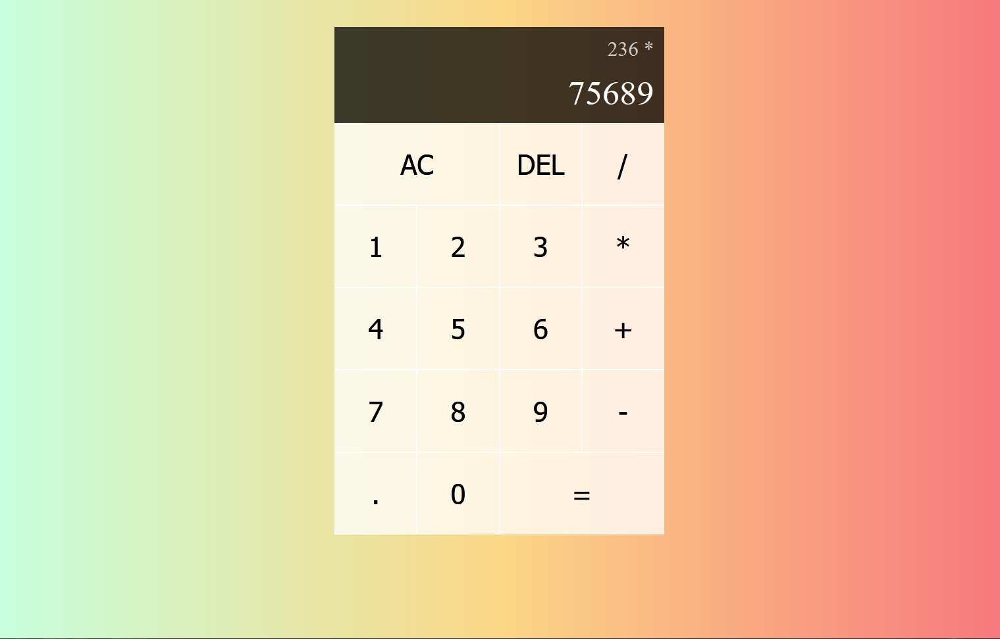

[](https://calculator-react-jay.netlify.app/)


## Features:
* The user can see weather for various cities
* The user can track and untrack the weather for saved cities
* The user can see the hourly/weekly/daily forecast for cities
* Simple modern design based on the Tilwind css framework
* Built to be mobile friendly

## Built With
* Vue
* Node js
* Tailwind css

## Todos
1. Improve user experience by adding loading animation when viewing cities
2. ~~Add ability to save cities~~
3. ~~show weekly forecast~~
3. Add support for celsius

## Project Setup

```sh
npm install
```

## Compile and Hot-Reload for Development

```sh
npm run dev
```

## Compile and Minify for Production

```sh
npm run build
```

